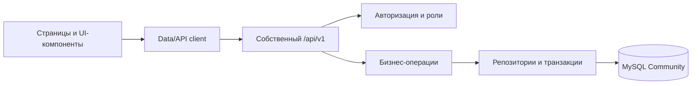

# Архитектура

## Состояние после подготовительного этапа

Репозиторий разделён на четыре границы:

1. `src/frontend` отвечает за страницы, навигацию, формы и согласованный UX прототипа.
2. `src/ui` содержит общий визуальный слой и адаптацию для мобильных экранов.
3. `src/domain` содержит правила, которые должны одинаково выполняться в интерфейсе, API и тестах: цены, баланс, посещения, зарплата, партнёрский расчёт и фиксация состава.
4. `src/data` содержит API-клиент. После появления backend UI должен получать DTO только через этот слой.

Backend находится в `backend/src`, структура MySQL — в `database`. Браузер никогда не получает учётные данные MySQL и не соединяется с базой напрямую.



## Текущий frontend

`src/frontend/crm-ui.js` — стабилизированный снимок рабочего прототипа. Один файл выбран на этом этапе намеренно: он сохраняет порядок всех ранее последовательно загружавшихся исправлений и исключает риск изменения UX при механическом переносе. Старые `v11.js`…`v149.js` больше не подключаются и удалены.

Этот файл остаётся переходным UI-слоем. Новую бизнес-логику в него добавлять нельзя. При реализации API страницы следует переносить по одной в `src/frontend/pages`, повторно используя `src/domain` и `src/data`, а не создавать новые патчи или глобальные переопределения.

## Целевой backend

Предлагаемая внутренняя структура при реализации:

```text
backend/src/
  server.mjs          HTTP, middleware, общий обработчик ошибок
  config.mjs          строгая загрузка окружения
  auth.mjs            роли и разрешения
  routes.mjs          маршрутизация /api/v1
  modules/
    children/         controller → service → repository
    groups/
    lessons/
    finance/
    salary/
    partners/
  db.mjs              pool и транзакции
```

Controller проверяет HTTP-ввод и формирует ответ. Service применяет бизнес-правила и открывает транзакцию. Repository выполняет параметризованные SQL-запросы. Финансовые операции, завершение занятия и перенос баланса должны быть атомарными транзакциями с idempotency key и блокировкой изменяемых строк `SELECT ... FOR UPDATE`.

## Источник истины

- Пользователи, роли, справочники и текущее состояние находятся в MySQL.
- Оплаты, возвраты, посещения, переносы, начисления и audit log хранятся как история; их нельзя молча пересчитывать по новым настройкам.
- `child_enrollments.balance_lessons` — быстрый текущий итог. Источником аудита остаётся `balance_entries` вместе с ценовыми лотами.
- Снимок основной группы создаётся при старте занятия в `lesson_roster_members`.
- Фактический преподаватель хранится в самом занятии и используется для зарплаты.

## Конкурентность и повторные запросы

Каждая изменяемая сущность имеет `updated_at`, а занятие — `lock_version`. Клиент передаёт ожидаемую версию при изменении. Повторное завершение занятия возвращает уже полученный результат и не создаёт второе списание благодаря уникальной связи `balance_entries.attendance_id` и `attendance_applied_at`.

Создание оплаты, возврата, перенос баланса и завершение занятия требуют `Idempotency-Key`. Сервер хранит ключ и результат, поэтому повтор после сетевой ошибки безопасен.

## Переход к API без переписывания UX

1. Реализовать auth и справочники в backend.
2. Добавить repository/service для детей и направлений.
3. Переключить соответствующие страницы с массива `state` на `ApiClient`.
4. Реализовать финансовые транзакции и сверить их с доменными тестами.
5. Перенести занятия, календарь, зарплату, партнёрство и статистику.
6. После полной регрессии удалить переходный in-memory state.

До завершения этих шагов текущий frontend не считается хранилищем данных.
