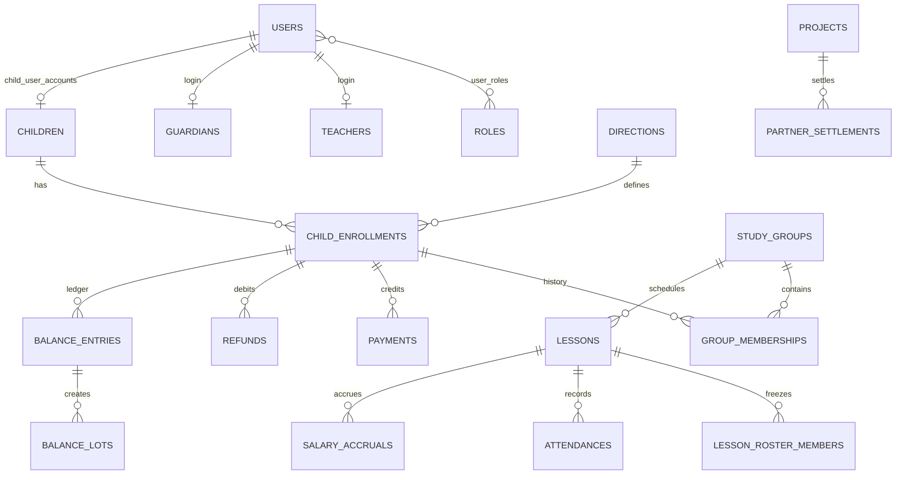

# Проект MySQL

Целевая СУБД — MySQL Community 8.x на Ubuntu 24.04. Кодировка всех таблиц — `utf8mb4`, движок — InnoDB. Начальная схема находится в `database/migrations/001_initial.sql`.

## Основные связи

## Группы таблиц

`users`, `roles`, `user_roles`, `auth_sessions` поддерживают несколько ролей пользователя. `teacher`, `partner`, `parent`, `child` не зашиты в колонку пользователя. Профили родителей и детей уже могут быть связаны с user, но регистрация и кабинеты на этом этапе не реализуются.

`children`, `guardians`, `child_guardians`, `child_enrollments`, `group_memberships` отделяют карточку ребёнка от направлений и истории групп. Уникальность `child_enrollments(child_id, direction_id)` гарантирует независимый баланс каждого направления.

`directions`, `sites`, `teachers`, `teacher_directions`, `projects`, `study_groups` — справочники и регулярное расписание.

`price_versions` хранит интервальные версии цен направления, группы или конкретного зачисления. В финансовой записи дополнительно хранится `price_snapshot`, поэтому закрытые операции не зависят от последующего изменения версии.

`lessons`, `lesson_roster_members`, `attendances`, `lesson_photos` разделяют плановое занятие, замороженный состав и фактическое присутствие. `actual_teacher_id` используется для зарплаты.

`payments`, `refunds`, `balance_transfers`, `balance_entries`, `balance_lots`, `balance_lot_consumptions` образуют финансовый журнал. `balance_entries` имеет уникальную ссылку на attendance, что защищает от двойного списания. Лоты сохраняют рублёвую стоимость остатка при разных исторических ценах.

`salary_rate_versions`, `salary_accruals`, `partner_agreement_versions`, `partner_settlements` сохраняют снимки ставок и готовых расчётов.

`notifications`, `idempotency_keys`, `audit_log` поддерживают напоминания, безопасные повторы API и аудит действий.

## Инварианты сервисного слоя

Некоторые правила нельзя надёжно выразить только внешними ключами и CHECK:

- направление группы обязано совпадать с направлением зачисления при создании membership;
- attendance платного посещения обязана ссылаться на enrollment того же ребёнка и направления;
- одновременно может быть только одна незакрытая версия цены одной области;
- завершение занятия, attendance, balance entry и salary accrual создаются одной транзакцией;
- перенос блокирует обе строки enrollment в стабильном порядке, чтобы избежать deadlock;
- кеш `balance_lessons` должен совпадать с суммой `balance_entries.lessons_delta`.

Эти инварианты проверяет backend service и периодическая read-only сверка.

## Миграции

Имена файлов: `NNN_описание.sql`, только по возрастанию. Применённый файл никогда не редактируется: runner сверяет SHA-256 и остановится при несовпадении. Любое изменение добавляется новой миграцией.

Runner создаёт только `schema_migrations` и таблицы внутри уже выбранной базы. Создание самой базы и отдельного пользователя выполняется один раз при настройке VPS. Ручное создание таблиц через FASTPANEL не требуется.

MySQL автоматически фиксирует многие DDL-операции, поэтому транзакция runner не делает сложную DDL-миграцию полностью атомарной. Каждая будущая миграция должна быть повторно безопасной, предварительно проверяться на `icube_test` и сопровождаться резервной копией production.
