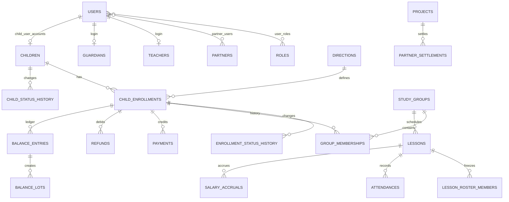

# Проект MySQL

Целевая СУБД — MySQL Community 8.x на Ubuntu 24.04. Кодировка всех таблиц — `utf8mb4`, движок — InnoDB. Начальная схема находится в `database/migrations/001_initial.sql`.

## Основные связи

## Группы таблиц

`users`, `roles`, `user_roles`, `auth_sessions` поддерживают несколько ролей пользователя. `teacher`, `partner`, `parent`, `child` не зашиты в колонку пользователя. `partner_users` связывает аккаунты с конкретными партнёрами и допускает несколько аккаунтов партнёра и несколько связей пользователя. Роль `partner` сама по себе не разрешает видеть все партнёрские данные: запросы фильтруются по `partner_users → partners → projects`. Профили родителей и детей уже могут быть связаны с user, но регистрация и кабинеты на этом этапе не реализуются.

`children`, `guardians`, `child_guardians`, `child_enrollments`, `group_memberships` отделяют карточку ребёнка от направлений и истории групп. Уникальность `child_enrollments(child_id, direction_id)` гарантирует независимый баланс каждого направления. Быстро созданный преподавателем ребёнок помечается `needs_director_review`, хранит `created_from_lesson_id` и `created_by_user_id`. Guardian создаётся только при наличии контакта; его имя может отсутствовать.

`child_status_history` и `enrollment_status_history` сохраняют старый и новый статус, время, автора и снимки проекта, направления и группы. Эти записи позволяют восстановить состояние на дату и корректно построить изменяемый текущий показатель «Ушли», не выводя его только из сегодняшнего статуса.

`directions`, `sites`, `teachers`, `teacher_directions`, `projects`, `study_groups` — справочники и регулярное расписание.

`price_versions` хранит интервальные версии цен направления, группы или конкретного зачисления. В финансовой записи дополнительно хранится `price_snapshot`, поэтому закрытые операции не зависят от последующего изменения версии.

`lessons`, `lesson_roster_members`, `attendances`, `lesson_photos` разделяют плановое занятие, замороженный состав и фактическое присутствие. При создании occurrence в `lessons.direction_id_snapshot`, `lessons.project_id_snapshot` и `lessons.site_id_snapshot` навсегда фиксируются направление, проект и площадка группы; дальнейшее изменение группы не меняет историческое занятие. `actual_teacher_id` используется для зарплаты. Миграция `008_lesson_deletion.sql` добавляет `lessons.deleted_at`: это постоянный tombstone явно удалённого occurrence, который исключается из рабочих выборок и не позволяет регулярной материализации восстановить занятие. При удалении самой очищенной группы её tombstones удаляются физически.

`payments`, `refunds`, `balance_transfers`, `balance_entries`, `balance_lots`, `balance_lot_consumptions` образуют финансовый журнал. После миграции `004` один attendance может иметь несколько последовательных debit-записей, но транзакционная блокировка допускает только один активный, ещё не обращённый эффект. Reversal явно и однозначно ссылается на исходную ledger-запись через уникальный `reversal_of_entry_id`; остальные типы записей не могут заполнять это поле. Лоты сохраняют рублёвую стоимость остатка при разных исторических ценах. Денежные колонки используют `DECIMAL(...,2)`, количества занятий — `DECIMAL(16,8)`. mysql2 возвращает их строками; backend не выполняет финансовые расчёты через бинарный JS float.

Миграция `007_refunds.sql` разрешает серверные операции без временной авторизации и добавляет уникальность `balance_entries.refund_id`. Возврат уменьшает именно lot исходной оплаты; удаление возврата транзакционно восстанавливает этот lot и баланс enrollment.

У оплаты без назначенной группы снимки `group_id_snapshot` и `project_id_snapshot` могут быть `NULL`. При первом назначении группы сервис может однократно заполнить только пустые снимки неразрешённых операций. Непустые исторические снимки неизменяемы. В партнёрском расчёте `cash` уменьшает будущий перевод только когда `project_id_snapshot` относится к конкретному партнёру; наличные проекта iCubeRobots партнёрскими не считаются.

`salary_rate_versions`, `salary_accruals`, `partner_agreement_versions`, `partner_settlements` сохраняют снимки ставок и готовых расчётов. При ретроактивном изменении посещений, фактического преподавателя или типа занятия текущее начисление получает `reversed_at`, а исправленное создаётся отдельной строкой с `supersedes_accrual_id = old.id`. Если правильное начисление равно нулю, старую запись можно только закрыть. Service-layer обеспечивает максимум одно незакрытое начисление на занятие.

`notifications`, `idempotency_keys`, `audit_log` поддерживают напоминания, безопасные повторы API и аудит действий.

## Инварианты сервисного слоя

Некоторые правила нельзя надёжно выразить только внешними ключами и CHECK:

- направление группы обязано совпадать с направлением зачисления при создании membership;
- attendance платного посещения обязана ссылаться на enrollment того же ребёнка и направления;
- одновременно может быть только одна незакрытая версия цены одной области;
- завершение занятия, attendance, balance entry и salary accrual создаются одной транзакцией;
- перенос блокирует обе строки enrollment в стабильном порядке, чтобы избежать deadlock;
- кеш `balance_lessons` должен совпадать с суммой `balance_entries.lessons_delta`.
- teacher-действия над занятием требуют не только permission, но и проверки связи авторизованного преподавателя с конкретным занятием;
- партнёрский `projectId` всегда пересекается с проектами, доступными пользователю через `partner_users`, и не принимается как самостоятельное основание доступа;
- исторические `group_id_snapshot`/`project_id_snapshot` заполняются только если они пусты и после заполнения не переписываются.
- после появления первого persisted lesson направление и проект группы неизменяемы; площадку, преподавателя и расписание разрешено менять для будущих occurrences, поскольку каждое занятие хранит собственные snapshots, преподавателя и время;

Эти инварианты проверяет backend service и периодическая read-only сверка.

## Миграции

Имена файлов: `NNN_описание.sql`, только по возрастанию. Применённый файл никогда не редактируется: runner сверяет SHA-256 и остановится при несовпадении. Любое изменение добавляется новой миграцией.

Runner создаёт только `schema_migrations` и таблицы внутри уже выбранной базы. Создание самой базы и отдельного пользователя выполняется один раз при настройке VPS. Ручное создание таблиц через FASTPANEL не требуется.

MySQL автоматически фиксирует многие DDL-операции, поэтому транзакция runner не делает сложную DDL-миграцию полностью атомарной. Каждая будущая миграция должна быть повторно безопасной, предварительно проверяться на `icube_test` и сопровождаться резервной копией production.
