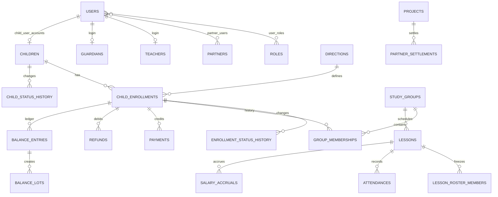

# Проект MySQL

Целевая СУБД — MySQL Community 8.x на Ubuntu 24.04. Кодировка всех таблиц — `utf8mb4`, движок — InnoDB. Начальная схема находится в `database/migrations/001_initial.sql`.

Бизнес-время CRM — `Asia/Sakhalin` (`+11:00`). Пул MySQL устанавливает тот же session time zone и получает `DATE`/`DATETIME` строками, чтобы драйвер или часовой пояс устройства не сдвигали календарное время занятия. API сериализует бизнес-время с явным `+11:00`; вычисление «сегодня» и календарных периодов выполняется общим модулем `src/shared/business-time.mjs`.

## Auth v1

`users` хранит нормализованный уникальный email, bcrypt hash пароля, статус и `token_version`; `user_roles` связывает пользователя с существующим справочником ролей. Преподаватель связывается с учётной записью через `teachers.user_id`, но карточка преподавателя может существовать без доступа в CRM.

`auth_sessions` хранит только SHA-256 hash случайного session token, срок действия, признак отзыва и снимок `token_version`. Миграция `011_auth_sessions_token_version.sql` добавляет снимок версии и безопасно заполняет его для существующих строк из `users`. При смене пароля или блокировке версия пользователя увеличивается, поэтому даже неотозванная строка старой сессии перестаёт проходить middleware.

## Основные связи

## Группы таблиц

`users`, `roles`, `user_roles`, `auth_sessions` поддерживают несколько ролей пользователя. `teacher`, `partner`, `parent`, `child` не зашиты в колонку пользователя. `partner_users` связывает аккаунты с конкретными партнёрами и допускает несколько аккаунтов партнёра и несколько связей пользователя. Роль `partner` сама по себе не разрешает видеть все партнёрские данные: запросы фильтруются по `partner_users → partners → projects`. Родительский аккаунт — обычный `users` с ролью `parent`; его профиль хранится в `guardians`, а many-to-many связь с детьми — в `child_guardians`.

Миграция `016_parent_portal.sql` добавляет настройки уведомлений по guardian/type, versioned документы и отдельные факты принятия каждой версии. Существующая `notifications` расширена `child_id`, навигационным `destination`, ссылкой на событие и уникальным `(user_id, dedup_key)`. Это позволяет позже подключить push как канал доставки той же записи. Удаление ребёнка обнуляет `notifications.child_id`, поэтому прочитанные уведомления не блокируют штатную очистку ребёнка.

Миграция `017_parent_absence_notices.sql` добавляет `lesson_child_absence_notices`. Уникальная пара `lesson_id + child_id` хранит активную или отменённую предварительную отметку и guardian, который её установил. Таблица намеренно не связана с `attendances` и финансовым ledger: отметка не является фактом посещения и не влияет на баланс или зарплату.

`children`, `guardians`, `child_guardians`, `child_enrollments`, `group_memberships` отделяют карточку ребёнка от направлений и истории групп. Начиная с миграции `013_partner_project_scope.sql`, `child_enrollments.project_id` задаёт владельца текущего направления; `superseded_at` закрывает историческую версию при переводе. Для пары `child_id + direction_id` сервис и уникальный индекс по вычисляемому `current_direction_id` допускают только один текущий enrollment, сохраняя любое число исторических версий. Балансы разных направлений независимы. Быстро созданный преподавателем ребёнок помечается `needs_director_review`, хранит `created_from_lesson_id` и `created_by_user_id`. Guardian создаётся только при наличии контакта; его имя может отсутствовать.

Та же миграция добавляет `sites.project_id`, `teacher_projects` (many-to-many), `enrollment_project_transfers` и `notifications.recipient_project_id`. Прежние общие площадки, используемые группами разных проектов, клонируются в отдельные записи; связи групп переназначаются без изменения исторических `lessons.site_id_snapshot` и `site_override_id`. Существующие преподаватели становятся доступными всем существующим проектам, затем директор может уточнить доступность. `price_versions.project_id` позволяет задать проектную базовую цену направления, сохраняя глобальные версии как fallback. Межпроектный transfer связывает старое и новое зачисления и, если был положительный остаток, существующий `balance_transfers`.

Миграция `018_project_teacher_and_current_invariants.sql` переносит активность преподавателя и его направления в проектный контекст: `teacher_projects.active` и `teacher_project_directions`. Общие ФИО, телефон и учётная запись остаются в `teachers`. Та же миграция добавляет ключ идемпотентного создания карточки ребёнка и уникальные вычисляемые ключи, запрещающие несколько текущих memberships, цен, ставок зарплаты и партнёрских соглашений одного контекста. Перед добавлением ограничений migration preflight намеренно останавливается на существующих конфликтах, не исправляя данные автоматически.
Ранее пустые `payments.project_id_snapshot` и `refunds.project_id_snapshot` миграция заполняет по сохранённой группе операции, а при её отсутствии — по проекту enrollment. Уже заполненные исторические снимки не меняются.

`child_status_history` и `enrollment_status_history` сохраняют старый и новый статус, время, автора и снимки проекта, направления и группы. Эти записи позволяют восстановить состояние на дату и корректно построить изменяемый текущий показатель «Ушли», не выводя его только из сегодняшнего статуса.

`directions`, `sites`, `teachers`, `teacher_projects`, `teacher_project_directions`, `projects`, `study_groups` — справочники и регулярное расписание. `teacher_directions` сохраняется как историческая совместимость до отдельной безопасной миграции удаления, но доступность новых назначений определяется проектной связью.

`price_versions` хранит интервальные версии цен направления, группы или конкретного зачисления. В финансовой записи дополнительно хранится `price_snapshot`, поэтому закрытые операции не зависят от последующего изменения версии.

`lessons`, `lesson_roster_members`, `attendances`, `lesson_photos` разделяют плановое занятие, замороженный состав, фактическое присутствие и metadata фотографий. При создании occurrence в `lessons.direction_id_snapshot`, `lessons.project_id_snapshot` и `lessons.site_id_snapshot` навсегда фиксируются направление, проект и площадка группы; дальнейшее изменение группы не меняет историческое занятие. `actual_teacher_id` используется для зарплаты. Миграция `008_lesson_deletion.sql` добавляет `lessons.deleted_at`: это постоянный tombstone явно удалённого occurrence, который исключается из рабочих выборок и не позволяет регулярной материализации восстановить занятие. При удалении самой очищенной группы её tombstones удаляются физически.

Миграция `015_lesson_photo_storage.sql` дополняет `lesson_photos` уникальным nullable `client_upload_id`, именем исходного файла, размерами, точным временем загрузки, сроком хранения и `purged_at`. В MySQL хранятся только metadata и приватный относительный `storage_key`; бинарные JPEG/PNG/WebP находятся вне web root в каталоге `PHOTO_STORAGE_DIR`. Новые записи всегда привязаны к ребёнку и занятию на service-layer. `client_upload_id` делает повтор offline-очереди идемпотентным. `deleted_at` отмечает ручное удаление/замену, `purged_at` — физическое отсутствие файла. Плановая очистка просроченного файла заполняет только `purged_at`, сохраняя факт фотографии для истории.

`payments`, `refunds`, `balance_transfers`, `balance_entries`, `balance_lots`, `balance_lot_consumptions` образуют финансовый журнал. После миграции `004` один attendance может иметь несколько последовательных debit-записей, но транзакционная блокировка допускает только один активный, ещё не обращённый эффект. Reversal явно и однозначно ссылается на исходную ledger-запись через уникальный `reversal_of_entry_id`; остальные типы записей не могут заполнять это поле. Лоты сохраняют рублёвую стоимость остатка при разных исторических ценах. Денежные колонки используют `DECIMAL(...,2)`, количества занятий — `DECIMAL(16,8)`. mysql2 возвращает их строками; backend не выполняет финансовые расчёты через бинарный JS float.

Миграция `009_balance_transfers.sql` разрешает `NULL` в `balance_transfers.created_by_user_id` на временном этапе до авторизации. Перенос блокирует оба enrollment в порядке id, поглощает прежний долг из старых source lots по FIFO, связывает фактически перенесённые части lots с `transfer_out` через `balance_lot_consumptions` и создаёт новый целевой lot из `transfer_in`.

Миграция `010_balance_transfer_reversal.sql` добавляет `balance_transfer_lot_changes`: для каждого нового переноса она сохраняет точные состояния lots до и после операции. Это позволяет безопасно отменить transfer без пересчёта по текущим ценам. Переносы, созданные до миграции и не имеющие полной истории lot changes, автоматически не восстанавливаются.

Миграция `007_refunds.sql` разрешает серверные операции без временной авторизации и добавляет уникальность `balance_entries.refund_id`. Возврат уменьшает именно lot исходной оплаты; удаление возврата транзакционно восстанавливает этот lot и баланс enrollment.

У оплаты без назначенной группы снимки `group_id_snapshot` и `project_id_snapshot` могут быть `NULL`. При первом назначении группы сервис может однократно заполнить только пустые снимки неразрешённых операций. Непустые исторические снимки неизменяемы. В партнёрском расчёте `cash` уменьшает будущий перевод только когда `project_id_snapshot` относится к конкретному партнёру; наличные проекта iCubeRobots партнёрскими не считаются.

`salary_rate_versions`, `salary_accruals`, `partner_agreement_versions`, `partner_settlements` сохраняют снимки ставок и готовых расчётов. При ретроактивном изменении посещений, фактического преподавателя или типа занятия текущее начисление получает `reversed_at`, а исправленное создаётся отдельной строкой с `supersedes_accrual_id = old.id`. Если правильное начисление равно нулю, старую запись можно только закрыть. Service-layer обеспечивает максимум одно незакрытое начисление на занятие.

Текущий `GET /partner-settlements` выполняет только live calculation и не пишет в таблицу `partner_settlements`. Оплаты и возвраты выбираются по собственному историческому `project_id_snapshot`, зарплата — по `lessons.project_id_snapshot`; текущая группа ребёнка или группы занятия не участвует в определении проекта.

`notifications`, `idempotency_keys`, `audit_log` поддерживают напоминания, безопасные повторы API и аудит действий.

## Инварианты сервисного слоя

Некоторые правила нельзя надёжно выразить только внешними ключами и CHECK:

- направление группы обязано совпадать с направлением зачисления при создании membership;
- attendance платного посещения обязана ссылаться на enrollment того же ребёнка и направления;
- одновременно может быть только одна незакрытая версия цены одной области;
- завершение занятия, attendance, balance entry и salary accrual создаются одной транзакцией;
- перенос блокирует обе строки enrollment в стабильном порядке, чтобы избежать deadlock;
- кеш `balance_lessons` должен совпадать с суммой `balance_entries.lessons_delta`.
- teacher-действия над занятием требуют не только permission, но и проверки связи авторизованного преподавателя с конкретным занятием;
- партнёрский `projectId` всегда пересекается с проектами, доступными пользователю через `partner_users`, и не принимается как самостоятельное основание доступа;
- исторические `group_id_snapshot`/`project_id_snapshot` заполняются только если они пусты и после заполнения не переписываются.
- после появления первого persisted lesson направление и проект группы неизменяемы; площадку, преподавателя и расписание разрешено менять для будущих occurrences, поскольку каждое занятие хранит собственные snapshots, преподавателя и время;

Эти инварианты проверяет backend service и периодическая read-only сверка.

## Миграции

Имена файлов: `NNN_описание.sql`, только по возрастанию. Применённый файл никогда не редактируется: runner сверяет SHA-256 и остановится при несовпадении. Любое изменение добавляется новой миграцией.

Runner создаёт `schema_migrations`, `schema_migration_runs` и `schema_migration_steps` внутри уже выбранной базы. Каждый SQL statement получает checksum и статус; полностью выполненные шаги пропускаются при повторе, а `schema_migrations` заполняется только после всех шагов. Если процесс оборвался после отправки DDL и результат неоднозначен, runner останавливается и требует проверки объекта БД вместо опасного автоматического повтора. Создание самой базы и отдельного пользователя выполняется один раз при настройке VPS. Ручное создание таблиц через FASTPANEL не требуется.

MySQL автоматически фиксирует многие DDL-операции, поэтому runner не изображает атомарность общей транзакцией. Каждая будущая миграция должна быть предварительно проверена на `icube_test` и сопровождаться резервной копией production.

### `site_rent_rate_versions`

Исторические ставки аренды площадок iCube за одно фактически проведённое занятие.

- `site_id` — площадка; FK использует `ON DELETE CASCADE`, поэтому одна только история ставок не блокирует удаление ошибочно созданной площадки без групп и занятий.
- `rate DECIMAL(12,2)` — стоимость одного проведённого занятия; `0.00` означает бесплатную площадку.
- `valid_from / valid_to` — период действия ставки. Генерируемый `current_site_id` + unique index гарантируют максимум одну текущую версию (`valid_to IS NULL`) на площадку.
- Первая ставка уже существующей площадки создаётся как baseline с `valid_from = 1970-01-01 00:00:00`; последующие изменения закрывают текущую версию и открывают новую с текущего времени.
- Для аренды занятия используется фактическая площадка `COALESCE(lessons.site_override_id, lessons.site_id_snapshot)` и версия ставки, действовавшая на `lessons.starts_at`. Текущая площадка группы и сегодняшняя ставка прошлое не переписывают.
